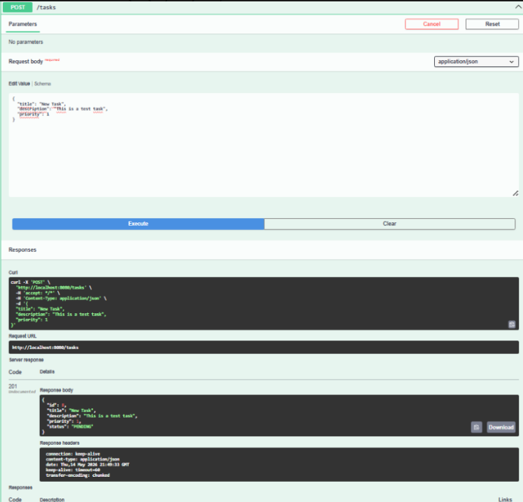
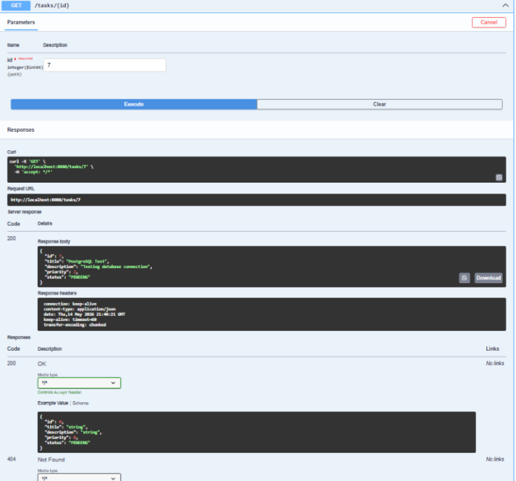
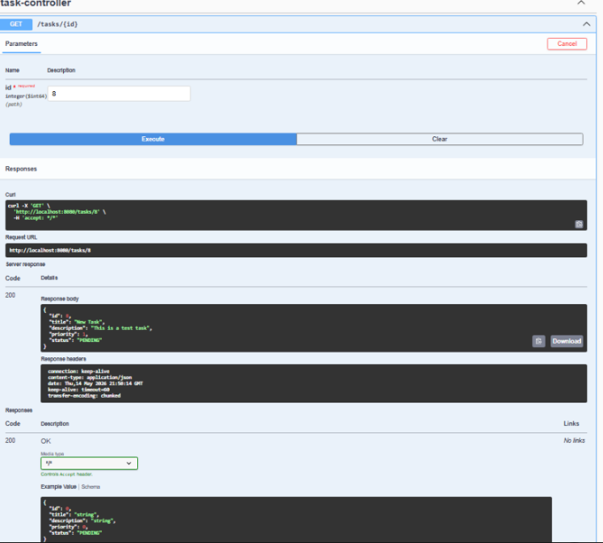

# TaskFlow

TaskFlow is a task management backend application built with Java and Spring Boot.

The project started as a console-based Java application 
and evolved into a RESTful backend API with PostgreSQL persistence, 
Swagger documentation, validation, exception handling, and automated testing.

## Features
- Create tasks
- List all tasks
- Get task by ID
- Update tasks
- Delete tasks
- Filter tasks by status
- Filter tasks by priority
- Search tasks by keyword
- Pagination support
- Task status update endpoints
- Automated controller and service tests
- PostgreSQL persistence
- Swagger/OpenAPI documentation
- Global exception handling
- Request validation

## Technologies
- Java 17
- Spring Boot
- Spring Data JPA
- Hibernate
- PostgreSQL
- Maven
- Swagger / OpenAPI
- JUnit 5
- Mockito
- MockMvc
- Git / GitHub

## Swagger API Preview

### Create Task Request



---

### Get Task By ID



---

### PostgreSQL Persistence Test

The task remains stored even after restarting the Spring Boot application.



---

## Swagger UI
```text
http://localhost:8081/swagger-ui/index.html
```

---

## Persistence

TaskFlow uses PostgreSQL for persistent data storage.

Data remains available even after restarting the Spring Boot application.

---

## How to Run
1. Clone the repository:
```
git clone https://github.com/sule-yavuz-dev/taskflow.git
```
2. Open the project in IntelliJ IDEA 

3. Create a local `application.properties` file inside:
```text
src/main/resources/application.properties
```

4. Add your PostgreSQL configuration:

```properties
spring.datasource.url=jdbc:postgresql://localhost:5432/taskflow_db
spring.datasource.username=postgres
spring.datasource.password=YOUR_PASSWORD
spring.datasource.driver-class-name=org.postgresql.Driver

spring.jpa.hibernate.ddl-auto=update
spring.jpa.show-sql=true
```

5. Run the `Application` class

6. Open Swagger UI:

```text
http://localhost:8081/swagger-ui/index.html
```

---

## Testing
TaskFlow includes:
- Unit tests with JUnit 5 and Mockito
- Controller layer tests with MockMvc

---

## Future Goal
The next step of the project is transforming TaskFlow 
into a complete full-stack task management application.